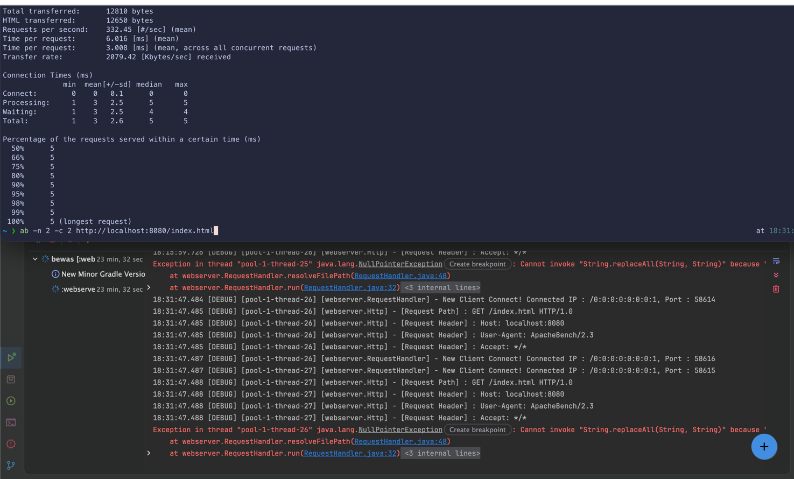

# be-DailyJob 

> 이 회고는 작업량을 보고하기 위한 문서가 아니라, 오늘 내가 어떤 판단을 했고 어떤 개발 행동을 반복하거나 바꿔야 하는지 확인하기 위한 기록입니다. 
> 각 항목은 길게 쓰기보다, 사실/판단/근거/다음 행동이 드러나게 구체적으로 작성하세요.

###### 1. 오늘 완료한 것
- 오늘 실제로 끝낸 기능/수정/학습: HTTP 객체 생성, 기능 단위 분리 Request-Response 역할 분리 구현
- (오늘의 목표 중에서) 아직 끝내지 못한 부분: request 라우팅 처리 및 User 비지니스 로직 구현 

###### 2. 오늘 가장 의미있었던 기술적 판단
- 내가 내린 판단:
- 그렇게 판단한 이유:
- 고려했지만 선택하지 않은 대안:
- 이 판단이 코드 품질/테스트/유지보수에 미친 영향:

###### 3. 가장 막혔던 문제와 해결 과정
- 문제 상황 또는 증상: 사이트에 여러 connection을 연결했을때 NullPointException이 발생함
- 처음 추측한 원인: Thread 풀을 의도적으로 적게 설정했을때 발생하는걸 확인하여 특정 요청이 먼저 Connection을 끊었을때 Path가 정상적으로 들어오지 않음으로 예상함
- 원인을 확인하기 위해 시도한 방법: Apache Benchmark를 사용해 Connection과 Request수룰 조정해 테스트함
- 실제 원인: 아직 해결하지 못해 더 확인이 필요함

###### 4. 오늘 잘한 행동(개발과 관련된 것)
- 어떤 행동이었는지:
- 그 접근이 도움이 된 이유:
- 다음에도 반복하고 싶은 점:

###### 5. 오늘 아쉬웠던 행동(개발과 관련된 것)
- 비효율적이었던 접근/놓치거나 부족했던 점: Thread에 대한 깊은 이해 없이 이 문제에 대해 알아보고 기존 코드에 대한 이해가 부족했던점
- 그렇게 된 원인: 기존 코드 분석 없이 Thread Connection 실패를 확인하기 위해 테스트를 여러 파라미터로 진행한게 잘못되었음
- 다음에는 다르게 해볼 구체적인 행동: 너무 매몰되어 생각하지 말고 한걸음 뒤에서 천천히 다시 확인해볼것
